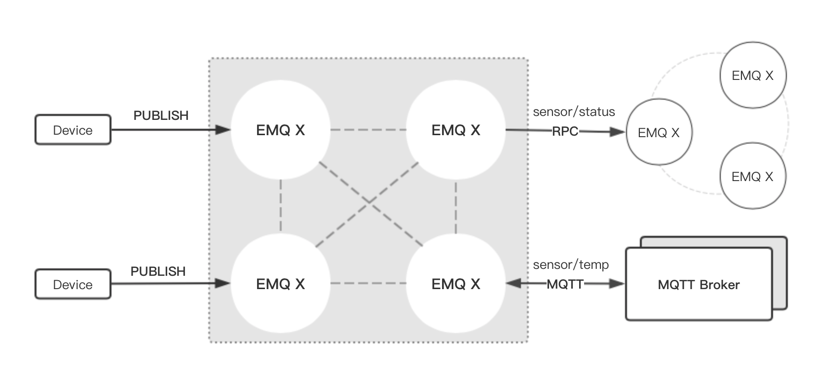

EMQ Bridge MQTT
===============

The concept of **Bridge** means that EMQX supports forwarding messages
of one of its own topics to another MQTT Broker in some way.

**Bridge** differs from **Cluster** in that the bridge does not
replicate the topic trie and routing tables and only forwards MQTT
messages based on bridging rules.

At present, the bridging methods supported by EMQX are as follows:

* RPC bridge: RPC Bridge only supports message forwarding and does not
  support subscribing to the topic of remote nodes to synchronize
  data;
* MQTT Bridge: MQTT Bridge supports both forwarding and data
  synchronization through subscription topic.

These concepts are shown below:

In addition, the EMQX message broker supports multi-node bridge mode interconnection

.. code-block::

                 ---------                     ---------                     ---------
   Publisher --> | Node1 | --Bridge Forward--> | Node2 | --Bridge Forward--> | Node3 | --> Subscriber
                 ---------                     ---------                     ---------

In EMQX, bridge is configured by modifying ``etc/emqx.conf``. EMQX distinguishes between different bridges based on different names. E.g

.. code-block::

   ## Bridge address: node name for local bridge, host:port for remote.
   bridge.mqtt.aws.address = 127.0.0.1:1883

This configuration declares a bridge named ``aws`` and specifies that it is bridged to the MQTT broker of 127.0.0.1:1883 by MQTT mode.

In case of creating multiple bridges, it is convenient to replicate all configuration items of the first bridge, and modify the bridge name and other configuration items if necessary (such as bridge.$name.address, where $name refers to the name of bridge)

The next two sections describe how to create a bridge in RPC and MQTT mode respectively and create a forwarding rule that forwards the messages from sensors. Assuming that two EMQX nodes are running on two hosts:

.. list-table::
   :header-rows: 1

   * - Name
     - Node
     - MQTT Port
   * - emqx1
     - emqx1@192.168.1.1.
     - 1883
   * - emqx2
     - emqx2@192.168.1.2
     - 1883

EMQX RPC Bridge Configuration
------------------------------

The following is the basic configuration of RPC bridging. A simplest RPC bridging only requires the following three items

.. code-block::

   ## Bridge Address: Use node name (nodename@host) for rpc bridging, and host:port for mqtt connection
   bridge.mqtt.emqx2.address = emqx2@192.168.1.2

   ## Forwarding topics of the message
   bridge.mqtt.emqx2.forwards = sensor1/#,sensor2/#

   ## bridged mountpoint
   bridge.mqtt.emqx2.mountpoint = bridge/emqx2/${node}/

If the messages received by the local node emqx1 matches the topic ``sersor1/#`` or ``sensor2/#``\ , these messages will be forwarded to the ``sensor1/#`` or ``sensor2/#`` topic of the remote node emqx2.

``forwards`` is used to specify topics. Messages of the in ``forwards`` specified topics on local node are forwarded to the remote node.

``mountpoint`` is used to add a topic prefix when forwarding a message. To use ``mountpoint``\ , the ``forwards`` directive must be set. In the above example, a message with the topic ``sensor1/hello`` received by the local node will be forwarded to the remote node with the topic ``bridge/emqx2/emqx1@192.168.1.1/sensor1/hello``.

Limitations of RPC bridging:

#. 
   The RPC bridge of emqx can only forward local messages to the remote node, and cannot synchronize the messages of the remote node to the local node;

#. 
   RPC bridge can only bridge two EMQX broker together and cannot bridge EMQX broker to other MQTT brokers.

EMQX MQTT Bridge Configuration
-------------------------------

EMQX 3.0 officially introduced MQTT bridge, so that EMQX can bridge any MQTT broker. Because of the characteristics of the MQTT protocol, EMQX can subscribe to the remote mqtt broker's topic through MQTT bridge, and then synchronize the remote MQTT broker's message to the local.

EMQX MQTT bridging principle: Create an MQTT client on the EMQX broker, and connect this MQTT client to the remote MQTT broker. Therefore, in the MQTT bridge configuration, following fields may be set for the EMQX to connect to the remote broker as an mqtt client

.. code-block::

   ## Bridge Address: Use node name for rpc bridging, use host:port for mqtt connection
   bridge.mqtt.emqx2.address = 192.168.1.2:1883

   ## Bridged Protocol Version
   ## Enumeration value: mqttv3 | mqttv4 | mqttv5
   bridge.mqtt.emqx2.proto_ver = mqttv4

   ## mqtt client's clientid
   bridge.mqtt.emqx2.clientid = bridge_emq

   ## mqtt client's clean_start field
   ## Note: Some MQTT Brokers need to set the clean_start value as `true`
   bridge.mqtt.emqx2.clean_start = true

   ##  mqtt client's username field
   bridge.mqtt.emqx2.username = user

   ## mqtt client's password field
   bridge.mqtt.emqx2.password = passwd

   ## Whether the mqtt client uses ssl to connect to a remote serve or not
   bridge.mqtt.emqx2.ssl = off

   ## CA Certificate of Client SSL Connection (PEM format)
   bridge.mqtt.emqx2.cacertfile = etc/certs/cacert.pem

   ## SSL certificate of Client SSL connection 
   bridge.mqtt.emqx2.certfile = etc/certs/client-cert.pem

   ## Key file of Client SSL connection 
   bridge.mqtt.emqx2.keyfile = etc/certs/client-key.pem

   ## TTLS PSK password
   ## Note 'listener.ssl.external.ciphers' and 'listener.ssl.external.psk_ciphers' cannot be configured at the same time
   ##
   ## See 'https://tools.ietf.org/html/rfc4279#section-2'.
   ## bridge.mqtt.emqx2.psk_ciphers = PSK-AES128-CBC-SHA,PSK-AES256-CBC-SHA,PSK-3DES-EDE-CBC-SHA,PSK-RC4-SHA

   ## Client's heartbeat interval
   bridge.mqtt.emqx2.keepalive = 60s

   ## Supported TLS version
   bridge.mqtt.emqx2.tls_versions = tlsv1.2

   ## SSL encryption
   bridge.mqtt.emqx2.ciphers = ECDHE-ECDSA-AES256-GCM-SHA384,ECDHE-RSA-AES256-GCM-SHA384

   ## Forwarding topics of the message
   bridge.mqtt.emqx2.forwards = sensor1/#,sensor2/#

   ## Bridged mountpoint
   bridge.mqtt.emqx2.mountpoint = bridge/emqx2/${node}/

   ## Subscription topic for bridging
   bridge.mqtt.emqx2.subscription.1.topic = cmd/topic1

   ## Subscription qos for bridging
   bridge.mqtt.emqx2.subscription.1.qos = 1

   ## Subscription topic for bridging
   bridge.mqtt.emqx2.subscription.2.topic = cmd/topic2

   ## Subscription qos for bridging
   bridge.mqtt.emqx2.subscription.2.qos = 1

   ## Bridging reconnection interval
   ## Default: 30s
   bridge.mqtt.emqx2.reconnect_interval = 30s

   ## QoS1 message retransmission interval
   bridge.mqtt.emqx2.retry_interval = 20s

   ## Inflight Size.
   bridge.mqtt.emqx2.max_inflight_batches = 32

Bridge Cache Configuration
--------------------------

The bridge of EMQX has a message caching mechanism. The caching mechanism is applicable to both RPC bridging and MQTT bridging. When the bridge is disconnected (such as when the network connection is unstable), the messages with a topic specified in ``forwards`` can be cached to the local message queue. Until the bridge is restored, these messages are re-forwarded to the remote node. The configuration of the cache queue is as follows

.. code-block::

   ## emqx_bridge internal number of messages used for batch
   bridge.mqtt.emqx2.queue.batch_count_limit = 32

   ##  emqx_bridge internal number of message bytes used for batch
   bridge.mqtt.emqx2.queue.batch_bytes_limit = 1000MB

   ## The path for placing replayq queue. If it is not specified, then replayq will run in `mem-only` mode and messages will not be cached on disk.
   bridge.mqtt.emqx2.queue.replayq_dir = data/emqx_emqx2_bridge/

   ## Replayq data segment size
   bridge.mqtt.emqx2.queue.replayq_seg_bytes = 10MB

``bridge.mqtt.emqx2.queue.replayq_dir`` is a configuration parameter for specifying the path of the bridge storage queue.

``bridge.mqtt.emqx2.queue.replayq_seg_bytes`` is used to specify the size of the largest single file of the message queue that is cached on disk. If the message queue size exceeds the specified value, a new file is created to store the message queue.

CLI for EMQX Bridge MQTT
-------------------------

CLI for EMQX Bridge MQTT:

.. code-block:: bash

   $ cd emqx1/ && ./bin/emqx_ctl bridges
   bridges list                                  # List bridges
   bridges start <Name>                          # Start a bridge
   bridges stop <Name>                           # Stop a bridge
   bridges forwards <Name>                       # Show a bridge forward topic
   bridges add-forward <Name> <Topic>            # Add bridge forward topic
   bridges del-forward <Name> <Topic>            # Delete bridge forward topic
   bridges subscriptions <Name>                  # Show a bridge subscriptions topic
   bridges add-subscription <Name> <Topic> <Qos> # Add bridge subscriptions topic

List all bridge states

.. code-block:: bash

   $ ./bin/emqx_ctl bridges list
   name: emqx     status: Stopped    $ ./bin/emqx_ctl bridges list
   name: emqx     status: Stopped

Start the specified bridge

.. code-block:: bash

   $ ./bin/emqx_ctl bridges start emqx
   Start bridge successfully.

Stop the specified bridge

.. code-block:: bash

   $ ./bin/emqx_ctl bridges stop emqx
   Stop bridge successfully.

List the forwarding topics for the specified bridge

.. code-block:: bash

   $ ./bin/emqx_ctl bridges forwards emqx
   topic:   topic1/#
   topic:   topic2/#

Add a forwarding topic for the specified bridge

.. code-block:: bash

   $ ./bin/emqx_ctl bridges add-forward emqx topic3/#
   Add-forward topic successfully.

Delete the forwarding topic for the specified bridge

.. code-block:: bash

   $ ./bin/emqx_ctl bridges del-forward emqx topic3/#
   Del-forward topic successfully.

List subscriptions for the specified bridge

.. code-block:: bash

   $ ./bin/emqx_ctl bridges subscriptions emqx
   topic: cmd/topic1, qos: 1
   topic: cmd/topic2, qos: 1

Add a subscription topic for the specified bridge

.. code-block:: bash

   $ ./bin/emqx_ctl bridges add-subscription emqx cmd/topic3 1
   Add-subscription topic successfully.

Delete the subscription topic for the specified bridge

.. code-block:: bash

   $ ./bin/emqx_ctl bridges del-subscription emqx cmd/topic3
   Del-subscription topic successfully.

Note: In case of creating multiple bridges, it is convenient to replicate all configuration items of the first bridge, and modify the bridge name and other configuration items if necessary.

