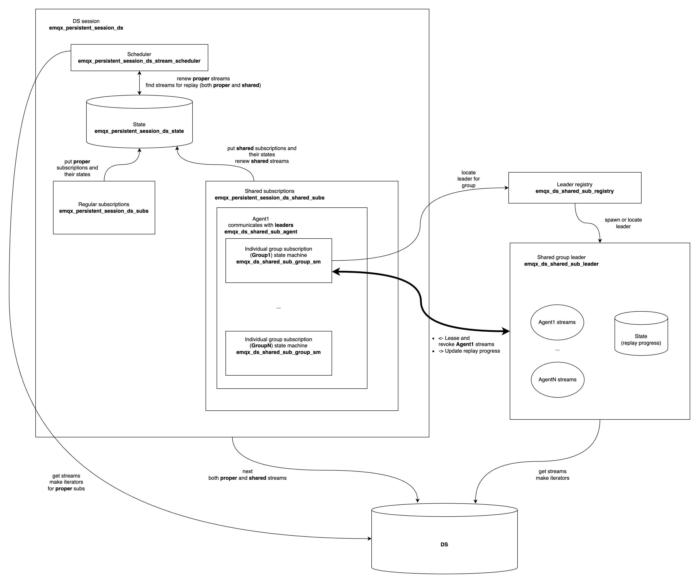

# EMQX Durable Shared Subscriptions

This application makes durable session capable to cooperatively replay messages from a topic.

# General layout and interaction with session

The general idea is described in the [EIP 0028](https://github.com/emqx/eip/blob/main/active/0028-durable-shared-subscriptions.md).

On the code level, the application is organized in the following way:

* The nesting reflects nesting/ownership of entity states.
* The bold arrow represent the [most complex interaction](https://github.com/emqx/eip/blob/main/active/0028-durable-shared-subscriptions.md#shared-subscription-session-handler), between session-side group subscription state machine (**GroupSM**) and the shared subscription leader (**Leader**).

# Contributing

Please see our [contributing.md](../../CONTRIBUTING.md).
