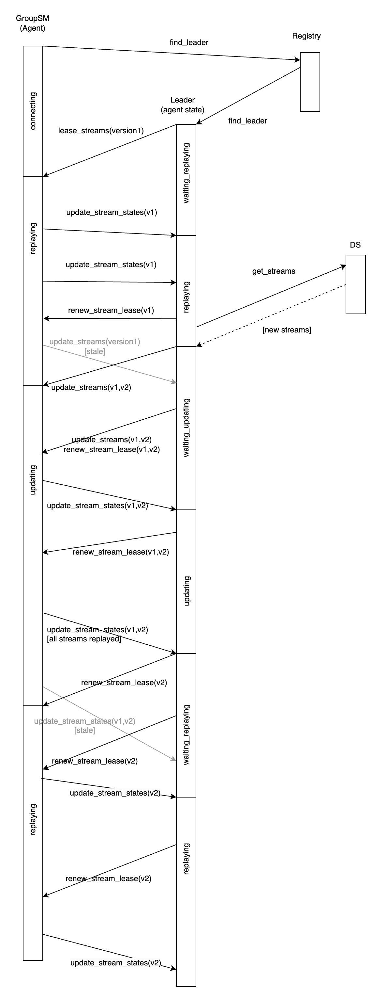

# EMQX Durable Shared Subscriptions

This application makes durable session capable to cooperatively replay messages from a topic.

# General layout and interaction with session

* The nesting reflects nesting/ownership of entity states.
* The bold arrow represent the [most complex interaction](https://github.com/emqx/eip/blob/main/active/0028-durable-shared-subscriptions.md#shared-subscription-session-handler), between session-side group subscription state machine (**GroupSM**) and the shared subscription leader (**Leader**).

# GroupSM and Leader communication

The target state of GroupSM and its representation in Leader is `replaying`. That is, when the GroupSM and the Leader agree on the leased streams, Leader sends lease confirmations to the GroupSM, the GroupSM sends iteration updates.

Other states are used to gracefully reassign streams to the GroupSM.

Below is the sequence diagram of the interaction.

# Contributing

Please see our [contributing.md](../../CONTRIBUTING.md).

# License

EMQ Business Source License 1.1, refer to [LICENSE](BSL.txt).
