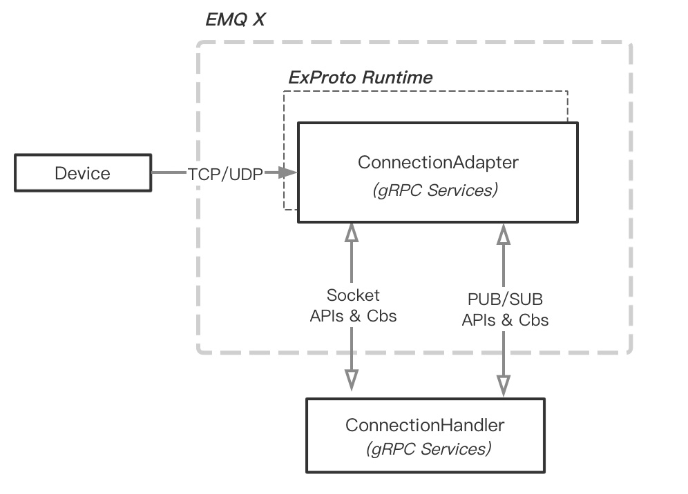

# emqx-exproto

The `emqx_exproto` extremly enhance the extensibility for EMQX. It allow using an others programming language to **replace the protocol handling layer in EMQX Broker**.

## Feature

- [x] Based on gRPC, it brings a very wide range of applicability
- [x] Allows you to use the return value to extend emqx behavior.

## Architecture

## Usage

### gRPC service

See: `priv/protos/exproto.proto`

## Example

## Recommended gRPC Framework

See: https://github.com/grpc-ecosystem/awesome-grpc
