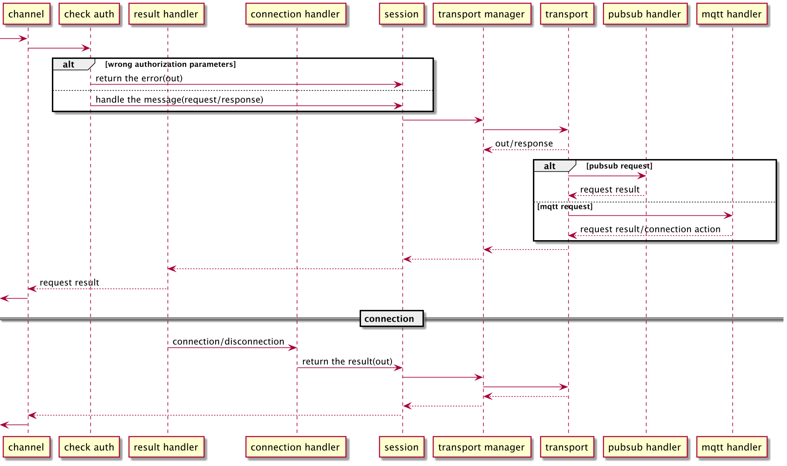

# Table of Contents

1.  [EMQX 5.0 CoAP Gateway](#org61e5bb8)
    1.  [Features](#orgeddbc94)
        1.  [PubSub Handler](#orgfc7be2d)
        2.  [MQTT Handler](#org55be508)
        3.  [Heartbeat](#org3d1a32e)
        4.  [Query String](#org9a6b996)
    2.  [Implementation](#org9985dfe)
        1.  [Request/Response flow](#orge94210c)
    3.  [Example](#ref_example)


<a id="org61e5bb8"></a>

# EMQX 5.0 CoAP Gateway

emqx-coap is a CoAP Gateway for EMQX. It translates CoAP messages into MQTT messages and make it possible to communiate between CoAP clients and MQTT clients.


<a id="orgeddbc94"></a>

## Features

-   Partially achieves [Publish-Subscribe Broker for the Constrained Application Protocol (CoAP)](https://datatracker.ietf.org/doc/html/draft-ietf-core-coap-pubsub-09)
    we called this as ps handler, include following functions:
    -   Publish
    -   Subscribe
    -   UnSubscribe
-   Long connection and authorization verification called as MQTT handler


<a id="orgfc7be2d"></a>

### PubSub Handler

1.  Publish

    Method: POST\
    URI Schema: ps/{+topic}{?q\*}\
    q\*: [Shared Options](#orgc50043b)\
    Response:

    -   2.04 "Changed" when success
    -   4.00 "Bad Request" when error
    -   4.01 "Unauthorized" when with wrong auth uri query

2.  Subscribe

    Method: GET
    Options:

    -   Observer = 0

    URI Schema: ps/{+topic}{?q\*}\
    q\*: see [Shared Options](#orgc50043b)\
    Response:

    -   2.05 "Content" when success
    -   4.00 "Bad Request" when error
    -   4.01 "Unauthorized" when with wrong auth uri query

```
          Client1   Client2                                          Broker
        |          |                   Subscribe                   |
        |          | ----- GET /ps/topic1 Observe:0 Token:XX ----> |
        |          |                                               |
        |          | <---------- 2.05 Content Observe:10---------- |
        |          |                                               |
        |          |                                               |
        |          |                    Publish                    |
        | ---------|----------- PUT /ps/topic1 "1033.3"  --------> |
        |          |                    Notify                     |
        |          | <---------- 2.05 Content Observe:11 --------- |
        |          |                                               |
```

3.  UnSubscribe

    Method : GET
    Options:

    -   Observe = 1

    URI Schema: ps/{+topic}{?q\*}\
    q\*: see [Shared Options](#orgc50043b)\
    Response:

    -   2.07 "No Content" when success
    -   4.00 "Bad Request" when error
    -   4.01 "Unauthorized" when with wrong auth uri query


<a id="org55be508"></a>

### MQTT Handler

   Establishing a connection is optional. If the CoAP client needs to use connection-based operations, it must first establish a connection.
At the same time, the connectionless mode and the connected mode cannot be mixed.
In connection mode, the Publish/Subscribe/UnSubscribe sent by the client must be has Token and ClientId in query string.
If the Token and Clientid is wrong/miss, EMQX will reset the request.
The communication token is the data carried in the response payload after the client successfully establishes a connection.
After obtaining the token, the client's subsequent request must attach "token=Token" to the Query String
ClientId is necessary when there is a connection, and is a unique identifier defined by the client.
The server manages the client through the ClientId. If the ClientId is wrong, EMQX will reset the request.

1.  Create a Connection

    Method: POST
    URI Schema: mqtt/connection{?q\*}
    q\*:

    -   clientid := client uid
    -   username
    -   password

    Response:

    -   2.01 "Created" when success
    -   4.00 "Bad Request" when error
    -   4.01 "Unauthorized" wrong username or password

    Payload: Token if success

2.  Close a Connection

    Method : DELETE
    URI Schema: mqtt/connection{?q\*}
    q\*:

    -   clientid := client uid
    -   token

    Response:

    -   2.01 "Deleted" when success
    -   4.00 "Bad Request" when error
    -   4.01 "Unauthorized" wrong clientid or token


<a id="org3d1a32e"></a>

### Heartbeat

The Coap client can maintain the "connection" with the server through the heartbeat,
regardless of whether it is authenticated or not,
so that the server will not release related resources
Method : PUT
URI Schema: mqtt/connection{?q\*}
q\*:

-   clientid if authenticated
-   token if authenticated

Response:

-   2.01 "Changed" when success
-   4.00 "Bad Request" when error
-   4.01 "Unauthorized" wrong clientid or token


<a id="org9a6b996"></a>

### Query String

CoAP gateway uses some options in query string to conversion between MQTT CoAP.

1.  Shared Options <a id="orgc50043b"></a>

    -   clientid
    -   token

2.  Connect Options

    -   username
    -   password

3.  Publish

    <table border="2" cellspacing="0" cellpadding="6" rules="groups" frame="hsides">


    <colgroup>
    <col  class="org-left" />

    <col  class="org-left" />

    <col  class="org-left" />
    </colgroup>
    <thead>
    <tr>
    <th scope="col" class="org-left">Option</th>
    <th scope="col" class="org-left">Type</th>
    <th scope="col" class="org-left">Default</th>
    </tr>
    </thead>

    <tbody>
    <tr>
    <td class="org-left">retain</td>
    <td class="org-left">boolean</td>
    <td class="org-left">false</td>
    </tr>


    <tr>
    <td class="org-left">qos</td>
    <td class="org-left">MQTT Qos</td>
    <td class="org-left">See <a href="#org0345c3e">here</a></td>
    </tr>


    <tr>
    <td class="org-left">expiry</td>
    <td class="org-left">Message Expiry Interval</td>
    <td class="org-left">0(Never expiry)</td>
    </tr>
    </tbody>
    </table>

4.  Subscribe

    <table border="2" cellspacing="0" cellpadding="6" rules="groups" frame="hsides">


    <colgroup>
    <col  class="org-left" />

    <col  class="org-left" />

    <col  class="org-right" />
    </colgroup>
    <thead>
    <tr>
    <th scope="col" class="org-left">Option</th>
    <th scope="col" class="org-left">Type</th>
    <th scope="col" class="org-right">Default</th>
    </tr>
    </thead>

    <tbody>
    <tr>
    <td class="org-left">qos</td>
    <td class="org-left">MQTT Qos</td>
    <td class="org-right">See <a href="#org2325c7d">here</a></td>
    </tr>


    <tr>
    <td class="org-left">nl</td>
    <td class="org-left">MQTT Subscribe No Local</td>
    <td class="org-right">0</td>
    </tr>


    <tr>
    <td class="org-left">rh</td>
    <td class="org-left">MQTT Subscribe Retain Handing</td>
    <td class="org-right">0</td>
    </tr>
    </tbody>
    </table>

5.  MQTT Qos <=> CoAP non/con

    1.notif_type
    Control the type of notify messages when the observed object has changed.Can be:

    -   non
    -   con
    -   qos
        in this value, MQTT Qos0 -> non, Qos1/Qos2 -> con

    2.subscribe_qos <a id="org2325c7d"></a>
    Control the qos of subscribe.Can be:

    -   qos0
    -   qos1
    -   qos2
    -   coap
        in this value, CoAP non -> qos0, con -> qos1

    3.publish_qos <a id="org0345c3e"></a>
    like subscribe_qos, but control the qos of the publish MQTT message


<a id="org9985dfe"></a>

## Implementation


<a id="orge94210c"></a>

### Request/Response flow



1.  Authorization check

    Check whether the clientid and token in the query string match the current connection

2.  Session

    Manager the "Transport Manager" "Observe Resources Manager" and next message id

3.  Transport Mnager

    Manager "Transport" create/close/dispatch

4.  Observe resources Mnager

    Mnager observe topic and token

5.  Transport

    

    1.  Shared State

        

6.  Handler

    1.  pubsub

        <table border="2" cellspacing="0" cellpadding="6" rules="groups" frame="hsides">


        <colgroup>
        <col  class="org-left" />

        <col  class="org-right" />

        <col  class="org-left" />
        </colgroup>
        <thead>
        <tr>
        <th scope="col" class="org-left">Method</th>
        <th scope="col" class="org-right">Observe</th>
        <th scope="col" class="org-left">Action</th>
        </tr>
        </thead>

        <tbody>
        <tr>
        <td class="org-left">GET</td>
        <td class="org-right">0</td>
        <td class="org-left">subscribe and reply result</td>
        </tr>


        <tr>
        <td class="org-left">GET</td>
        <td class="org-right">1</td>
        <td class="org-left">unsubscribe and reply result</td>
        </tr>


        <tr>
        <td class="org-left">POST</td>
        <td class="org-right">X</td>
        <td class="org-left">publish and reply result</td>
        </tr>
        </tbody>
        </table>

    2.  mqtt

        <table border="2" cellspacing="0" cellpadding="6" rules="groups" frame="hsides">


        <colgroup>
        <col  class="org-left" />

        <col  class="org-left" />
        </colgroup>
        <thead>
        <tr>
        <th scope="col" class="org-left">Method</th>
        <th scope="col" class="org-left">Action</th>
        </tr>
        </thead>

        <tbody>
        <tr>
        <td class="org-left">PUT</td>
        <td class="org-left">reply result</td>
        </tr>


        <tr>
        <td class="org-left">POST</td>
        <td class="org-left">return create connection action</td>
        </tr>


        <tr>
        <td class="org-left">DELETE</td>
        <td class="org-left">return close connection action</td>
        </tr>
        </tbody>
        </table>

<a id="ref_example"></a>

## Example
1. Create Connection
```
coap-client -m post -e "" "coap://127.0.0.1/mqtt/connection?clientid=123&username=admin&password=public"
```
Server will return token **X** in payload

2. Update Connection
```
coap-client -m put -e "" "coap://127.0.0.1/mqtt/connection?clientid=123&token=X"
```

3. Publish
```
coap-client -m post -e "Hellow" "obstoken" "coap://127.0.0.1/ps/coap/test?clientid=123&username=admin&password=public"
```
if you want to publish with auth, you must first establish a connection, and then post publish request on the same socket, so libcoap client can't simulation publish with a token

```
coap-client -m post -e "Hellow" "coap://127.0.0.1/ps/coap/test?clientid=123&token=X"
```

4. Subscribe
```
coap-client -m get -s 60 -O 6,0x00 -o - -T "obstoken" "coap://127.0.0.1/ps/coap/test?clientid=123&username=admin&password=public"
```
**Or**

```
coap-client -m get -s 60 -O 6,0x00 -o - -T "obstoken" "coap://127.0.0.1/ps/coap/test?clientid=123&token=X"
```
5. Close Connection
```
coap-client -m delete -e "" "coap://127.0.0.1/mqtt/connection?clientid=123&token=X
```

