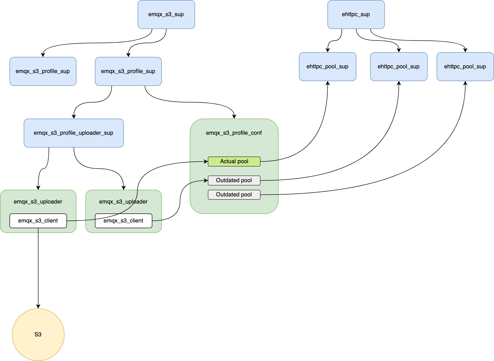

# emqx_s3

EMQX S3 Application

## Description

This application provides functionality for uploading files to S3.

## Usage

The steps to integrate this application are:
* Integrate S3 configuration schema where needed.
* On _client_ application start:
    * Call `emqx_s3:start_profile(ProfileName, ProfileConfig)` with configuration.
    * Add `emqx_config_handler` hook to call `emqx_s3:start_profile(ProfileName, ProfileConfig)` when configuration is updated.
* On _client_ application stop, call `emqx_s3:stop_profile(ProfileName)`.

`ProfileName` is a unique name used to distinguish different sets of S3 settings. Each profile has its own connection pool and configuration.

To use S3 from a _client_ application:
* Create an uploader process with `{ok, Pid} = emqx_s3:start_uploader(ProfileName, MyKey, _Opts = #{})`.
* Write data with `emqx_s3_uploader:write(Pid, <<"data">>)`.
* Finish the uploader with `emqx_s3_uploader:complete(Pid)` or `emqx_s3_uploader:abort(Pid)`.

### Configuration

Example of integrating S3 configuration schema into a _client_ application `emqx_someapp`.

```erlang
-module(emqx_someapp_schema).

...

roots() -> [someapp]
...

fields(someapp) ->
    [
        {other_setting, ...},
        {s3_settings,
            mk(
                hoconsc:ref(emqx_s3_schema, s3),
                #{
                    desc => ?DESC("s3_settings"),
                    required => true
                }
            )}
    ];
...

```

### Application start and config hooks

```erlang
-module(emqx_someapp_app).

-behaviour(application).

-export([start/2, stop/1]).

-export([
    pre_config_update/3,
    post_config_update/5
]).

start(_StartType, _StartArgs) ->
    ProfileConfig = emqx_config:get([someapp, s3_settings]),
    ProfileName = someapp,
    ok = emqx_s3:start_profile(ProfileName, ProfileConfig),
    ok = emqx_config_handler:add_handler([someapp], ?MODULE).

stop(_State) ->
    ok = emqx_conf:remove_handler([someapp]),
    ProfileName = someapp,
    ok = emqx_s3:stop_profile(ProfileName).

pre_config_update(_Path, NewConfig, _OldConfig) ->
    {ok, NewConfig}.

post_config_update(Path, _Req, NewConfig, _OldConfig, _AppEnvs) ->
    NewProfileConfig = maps:get(s3_settings, NewConfig),
    ProfileName = someapp,
    %% more graceful error handling may be needed
    ok = emqx_s3:update_profile(ProfileName, NewProfileConfig).

```

### Uploader usage

```erlang
-module(emqx_someapp_logic).
...

-spec do_upload_data(Key :: string(), Data :: binary()) -> ok.
do_upload_data(Key, Data) ->
    ProfileName = someapp,
    {ok, Pid} = emqx_s3:start_uploader(ProfileName, #{key => Key}),
    ok = emqx_s3_uploader:write(Pid, Data),
    ok = emqx_s3_uploader:complete(Pid).

```

## Design



* Each profile has its own supervisor `emqx_s3_profile_sup`.
* Under each profile supervisor, there is a
    * `emqx_s3_profile_uploader_sup` supervisor for uploader processes.
    * `emqx_s3_profile_conf` server for managing profile configuration.

When an uploader process is started, it checkouts the actual S3 configuration for the profile from the `emqx_s3_profile_conf` server. It uses the obtained configuration and connection pool to upload data to S3 till the termination, even if the configuration is updated.

Other processes (`emqx_XXX`) can also checkout the actual S3 configuration for the profile from the `emqx_s3_profile_conf` server.

`emqx_s3_profile_conf`:
* Keeps actual S3 configuration for the profile and creates a connection pool for the actual configuration.
* Creates a new connection pool when the configuration is updated.
* Keeps track of uploaders using connection pools.
* Drops connection pools when no uploaders are using it or after a timeout.

The code is designed to allow a painless transition from `ehttpc` pool to any other HTTP pool/client.

## Possible performance improvements

One of the downsides of the current implementation is that there is a lot of message passing between the uploader client and the actual sockets.

A possible improvement could be:
* Use a process-less HTTP client, like [Mint](https://github.com/elixir-mint/mint).
* Use a resource pool, like [NimblePool](https://github.com/dashbitco/nimble_pool) to manage the HTTP connections. It temporarily grants sockets to its clients.
* Do the buffering logic locally in the uploader client.
* Use `emqx_s3_client` directly from the uploader client.

In this case, the data will be directly sent to the socket, without being sent to any intermediate processes.
