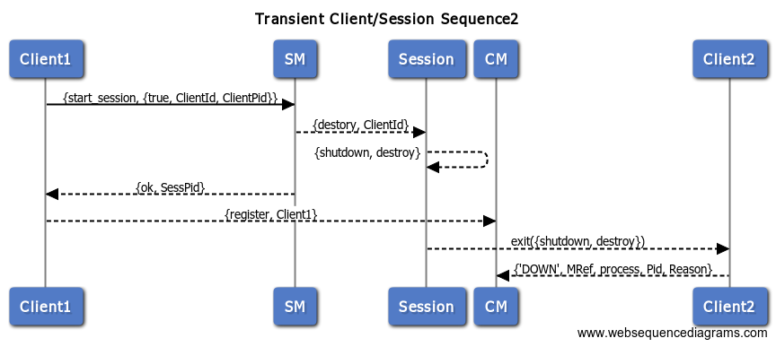
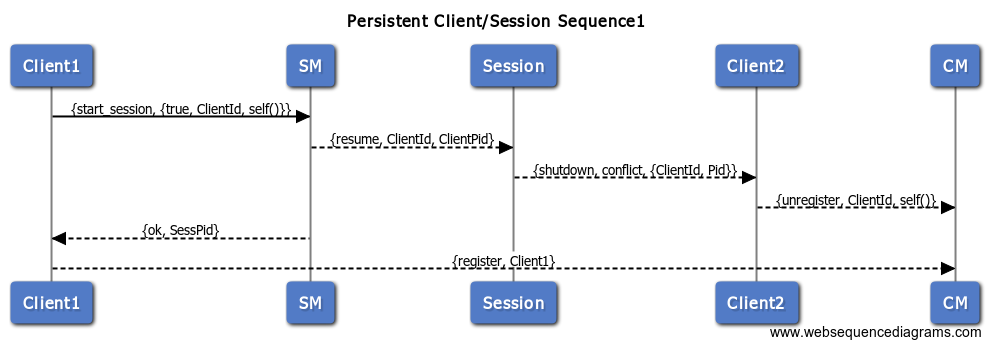

## Transient Client/Session Sequence1

```
Client1->SM:  {start_session, {true, ClientId, self()}}
SM-->Session: {destory, ClientId}
Session-->Session: {shutdown, destroy}
Session-->Client2: exit({shutdown, destroy})
Client2-->CM: {'DOWN', MRef, process, Pid, Reason}
SM-->Client1: {ok, SessPid}
Client1-->CM: {register, Client1}
```


## Transient Client/Session Sequence2


```
Client1->SM:  {start_session, {true, ClientId, self()}}
SM-->Session: {destory, ClientId}
Session-->Session: {shutdown, destroy}
SM-->Client1: {ok, SessPid}
Client1-->CM: {register, Client1}
Session-->Client2: exit({shutdown, destroy})
Client2-->CM: {'DOWN', MRef, process, Pid, Reason}
```



## Persistent Client/Session Sequence1

```
Client1->SM: {start_session, {true, ClientId, self()}}
SM-->Session: {resume, ClientId, ClientPid}
Session-->Client2: {shutdown, conflict, {ClientId, Pid}}
Client2-->CM: {unregister, ClientId, self()}
SM-->Client1: {ok, SessPid}
Client1-->CM: {register, Client1}
```




## Persistent Client/Session Sequence2

```
Client1->SM: {start_session, {true, ClientId, self()}}
SM-->Session: {resume, ClientId, ClientPid}
SM-->Client1: {ok, SessPid}
Client1-->CM: {register, Client1}
Session-->Client2: {shutdown, conflict, {ClientId, Pid}}
Client2-->CM: {unregister, ClientId, self()}
```


