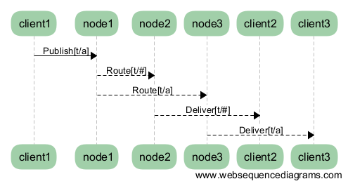

.. _design:

======
Design
======

.. _design_architecture:

------------
Architecture
------------

The emqttd broker 1.0 is more like a network Switch or Router, not a traditional enterprise message queue. Compared to a network router that routes packets based on IP or MPLS label, the emqttd broker routes MQTT messages based on topic trie.

.. image:: _static/images/concept.png

Design Philosophy
-----------------

1. Focus on handling millions of MQTT connections and routing MQTT messages between clustered nodes.

2. Embrace Erlang/OTP, The Soft-Realtime, Low-Latency, Concurrent and Fault-Tolerant Platform.

3. Layered Design: Connection, Session, PubSub and Router Layers.

4. Separate the Message Flow Plane and the Control/Management Plane.

5. Stream MQTT messages to various backends including MQ or databases.

System Layers
-------------

1. Connection Layer

   Handle TCP and WebSocket connections, encode/decode MQTT packets.

2. Session Layer

   Process MQTT PUBLISH/SUBSCRIBE Packets received from client, and deliver MQTT messages to client.

3. PubSub Layer

   Dispatch MQTT messages to subscribers in a node.

4. Routing(Distributed) Layer

   Route MQTT messages among clustered nodes.

----------------
Connection Layer
----------------

This layer is built on the `eSockd`_ library which is a general Non-blocking TCP/SSL Socket Server:

* Acceptor Pool and Asynchronous TCP Accept
* Parameterized Connection Module
* Max connections management
* Allow/Deny by peer address or CIDR
* Keepalive Support
* Rate Limit based on The Leaky Bucket Algorithm
* Fully Asynchronous TCP RECV/SEND

This layer is also responsible for encoding/decoding MQTT frames:

1. Parse MQTT frames received from client
2. Serialize MQTT frames sent to client
3. MQTT Connection Keepalive

Main erlang modules of this layer:

+------------------+--------------------------+
| Module           | Description              |
+==================+==========================+
| emqttd_client    | TCP Client               |
+------------------+--------------------------+
| emqttd_ws_client | WebSocket Client         |
+------------------+--------------------------+
| emqttd_protocol  | MQTT Protocol Handler    |
+------------------+--------------------------+
| emqttd_parser    | MQTT Frame Parser        |
+------------------+--------------------------+
| emqttd_serializer| MQTT Frame Serializer    |
+------------------+--------------------------+

-------------
Session Layer
-------------

The session layer processes MQTT packets received from client and delivers PUBLISH packets to client.

A MQTT session will store the subscriptions and inflight messages in memory:

1. The Client’s subscriptions.

2. Inflight qos1/2 messages sent to the client but unacked, QoS 2 messages which
   have been sent to the Client, but have not been completely acknowledged.

3. Inflight qos2 messages received from client and waiting for PUBREL. QoS 2
   messages which have been received from the Client, but have not been
   completely acknowledged.

4. All qos1, qos2 messages published to when client is disconnected.

MQueue and Inflight Window
--------------------------

Concept of Message Queue and Inflight Window::

          |<----------------- Max Len ----------------->|
          -----------------------------------------------
    IN -> |     Messages Queue    |  Inflight Window    | -> Out
          -----------------------------------------------
                                  |<---   Win Size  --->|

1. Inflight Window to store the messages delivered and await for PUBACK.

2. Enqueue messages when the inflight window is full.

3. If the queue is full, drop qos0 messages if store_qos0 is true, otherwise drop the oldest one.

The larger the inflight window size is, the higher the throughput is. The smaller the window size is, the more strict the message order is.

PacketId and MessageId
----------------------

The 16-bit PacketId is defined by MQTT Protocol Specification, used by client/server to PUBLISH/PUBACK packets. A GUID(128-bit globally unique Id) will be generated by the broker and assigned to a MQTT message.

Format of the globally unique message id::

    --------------------------------------------------------
    |        Timestamp       |  NodeID + PID  |  Sequence  |
    |<------- 64bits ------->|<--- 48bits --->|<- 16bits ->|
    --------------------------------------------------------

1. Timestamp: erlang:system_time if Erlang >= R18, otherwise os:timestamp
2. NodeId:    encode node() to 2 bytes integer
3. Pid:       encode pid to 4 bytes integer
4. Sequence:  2 bytes sequence in one process

The PacketId and MessageId in a End-to-End Message PubSub Sequence::

    PktId <-- Session --> MsgId <-- Router --> MsgId <-- Session --> PktId

------------
PubSub Layer
------------

The PubSub layer maintains a subscription table and is responsible to dispatch MQTT messages to subscribers.

.. image:: _static/images/dispatch.png

MQTT messages will be dispatched to the subscriber's session, which finally delivers the messages to client.

-------------
Routing Layer
-------------

The routing(distributed) layer maintains and replicates the global Topic Trie and Routing Table. The topic tire is composed of wildcard topics created by subscribers. The Routing Table maps a topic to nodes in the cluster.

For example, if node1 subscribed 't/+/x' and 't/+/y', node2 subscribed 't/#' and node3 subscribed 't/a', there will be a topic trie and route table::

    -------------------------
    |            t          |
    |           / \         |
    |          +   #        |
    |        /  \           |
    |      x      y         |
    -------------------------
    | t/+/x -> node1, node3 |
    | t/+/y -> node1        |
    | t/#   -> node2        |
    | t/a   -> node3        |
    -------------------------

The routing layer would route MQTT messages among clustered nodes by topic trie match and routing table lookup:

The routing design follows two rules:

1. A message only gets forwarded to other cluster nodes if a cluster node is interested in it. This reduces the network traffic tremendously, because it prevents nodes from forwarding unnecessary messages.

2. As soon as a client on a node subscribes to a topic it becomes known within the cluster. If one of the clients somewhere in the cluster is publishing to this topic, the message will be delivered to its subscriber no matter to which cluster node it is connected.

.. _design_auth_acl:

----------------------
Authentication and ACL
----------------------

The emqttd broker supports an extensible authentication/ACL mechanism, which is implemented by emqttd_access_control, emqttd_auth_mod and emqttd_acl_mod modules.

emqttd_access_control module provides two APIs that help register/unregister auth or ACL module:

.. code-block:: erlang

    register_mod(auth | acl, atom(), list()) -> ok | {error, any()}.

    register_mod(auth | acl, atom(), list(), non_neg_integer()) -> ok | {error, any()}.

Authentication Bahaviour
-------------------------

The emqttd_auth_mod defines an Erlang behaviour for authentication module:

.. code-block:: erlang

    -module(emqttd_auth_mod).

    -ifdef(use_specs).

    -callback init(AuthOpts :: list()) -> {ok, State :: any()}.

    -callback check(Client, Password, State) -> ok | ignore | {error, string()} when
        Client    :: mqtt_client(),
        Password  :: binary(),
        State     :: any().

    -callback description() -> string().

    -else.

    -export([behaviour_info/1]).

    behaviour_info(callbacks) ->
        [{init, 1}, {check, 3}, {description, 0}];
    behaviour_info(_Other) ->
        undefined.

    -endif.

The authentication modules implemented by default:

+-----------------------+--------------------------------+
| Module                | Authentication                 |
+-----------------------+--------------------------------+
| emqttd_auth_username  | Username and Password          |
+-----------------------+--------------------------------+
| emqttd_auth_clientid  | ClientID                       |
+-----------------------+--------------------------------+
| emqttd_auth_ldap      | LDAP                           |
+-----------------------+--------------------------------+
| emqttd_auth_anonymous | Anonymous                      |
+-----------------------+--------------------------------+

Authorization(ACL)
------------------

The emqttd_acl_mod defines an Erlang behavihour for ACL module:

.. code-block:: erlang

    -module(emqttd_acl_mod).

    -include("emqttd.hrl").

    -ifdef(use_specs).

    -callback init(AclOpts :: list()) -> {ok, State :: any()}.

    -callback check_acl({Client, PubSub, Topic}, State :: any()) -> allow | deny | ignore when
        Client   :: mqtt_client(),
        PubSub   :: pubsub(),
        Topic    :: binary().

    -callback reload_acl(State :: any()) -> ok | {error, any()}.

    -callback description() -> string().

    -else.

    -export([behaviour_info/1]).

    behaviour_info(callbacks) ->
        [{init, 1}, {check_acl, 2}, {reload_acl, 1}, {description, 0}];
    behaviour_info(_Other) ->
        undefined.

    -endif.

emqttd_acl_internal implements the default ACL based on etc/acl.config file:

.. code-block:: erlang

    %%%-----------------------------------------------------------------------------
    %%%
    %%% -type who() :: all | binary() |
    %%%                {ipaddr, esockd_access:cidr()} |
    %%%                {client, binary()} |
    %%%                {user, binary()}.
    %%%
    %%% -type access() :: subscribe | publish | pubsub.
    %%%
    %%% -type topic() :: binary().
    %%%
    %%% -type rule() :: {allow, all} |
    %%%                 {allow, who(), access(), list(topic())} |
    %%%                 {deny, all} |
    %%%                 {deny, who(), access(), list(topic())}.
    %%%
    %%%-----------------------------------------------------------------------------

    {allow, {user, "dashboard"}, subscribe, ["$SYS/#"]}.

    {allow, {ipaddr, "127.0.0.1"}, pubsub, ["$SYS/#", "#"]}.

    {deny, all, subscribe, ["$SYS/#", {eq, "#"}]}.

    {allow, all}.

.. _design_hook:

------------
Hooks Design
------------

The emqttd broker implements a simple but powerful hooks mechanism to help users develop plugin. The broker would run the hooks when a client is connected/disconnected, a topic is subscribed/unsubscribed or a MQTT message is published/delivered/acked.

Hooks defined by the emqttd 1.0 broker:

+------------------------+------------------------------------------------------+
| Hook                   | Description                                          |
+========================+======================================================+
| client.connected       | Run when client connected to the broker successfully |
+------------------------+------------------------------------------------------+
| client.subscribe       | Run before client subscribes topics                  |
+------------------------+------------------------------------------------------+
| client.subscribe.after | Run After client subscribed topics                   |
+------------------------+------------------------------------------------------+
| client.unsubscribe     | Run when client unsubscribes topics                  |
+------------------------+------------------------------------------------------+
| message.publish        | Run when a MQTT message is published                 |
+------------------------+------------------------------------------------------+
| message.delivered      | Run when a MQTT message is delivered                 |
+------------------------+------------------------------------------------------+
| message.acked          | Run when a MQTT message is acked                     |
+------------------------+------------------------------------------------------+
| client.disconnected    | Run when client disconnected from broker             |
+------------------------+------------------------------------------------------+

The emqttd broker uses the `Chain-of-responsibility_pattern`_ to implement hook mechanism. The callback functions registered to hook will be executed one by one::

                     --------  ok | {ok, NewAcc}   --------  ok | {ok, NewAcc}   --------
     (Args, Acc) --> | Fun1 | -------------------> | Fun2 | -------------------> | Fun3 | --> {ok, Acc} | {stop, Acc}
                     --------                      --------                      --------
                        |                             |                             |
                   stop | {stop, NewAcc}         stop | {stop, NewAcc}         stop | {stop, NewAcc}

The callback function for a hook should return:

+-----------------+------------------------+
| Return          | Description            |
+=================+========================+
| ok              | Continue               |
+-----------------+------------------------+
| {ok, NewAcc}    | Return Acc and Continue|
+-----------------+------------------------+
| stop            | Break                  |
+-----------------+------------------------+
| {stop, NewAcc}  | Return Acc and Break   |
+-----------------+------------------------+

The input arguments for a callback function are depending on the types of hook. Clone the `emqttd_plugin_template`_ project to check the argument in detail.

Hook Implementation
-------------------

The hook APIs defined in emqttd module:

.. code-block:: erlang

    -module(emqttd).

    %% Hooks API
    -export([hook/4, hook/3, unhook/2, run_hooks/3]).
    hook(Hook :: atom(), Callback :: function(), InitArgs :: list(any())) -> ok | {error, any()}.

    hook(Hook :: atom(), Callback :: function(), InitArgs :: list(any()), Priority :: integer()) -> ok | {error, any()}.

    unhook(Hook :: atom(), Callback :: function()) -> ok | {error, any()}.

    run_hooks(Hook :: atom(), Args :: list(any()), Acc :: any()) -> {ok | stop, any()}.

And implemented in emqttd_hook module:

.. code-block:: erlang

    -module(emqttd_hook).

    %% Hooks API
    -export([add/3, add/4, delete/2, run/3, lookup/1]).

    add(HookPoint :: atom(), Callback :: function(), InitArgs :: list(any())) -> ok.

    add(HookPoint :: atom(), Callback :: function(), InitArgs :: list(any()), Priority :: integer()) -> ok.

    delete(HookPoint :: atom(), Callback :: function()) -> ok.

    run(HookPoint :: atom(), Args :: list(any()), Acc :: any()) -> any().

    lookup(HookPoint :: atom()) -> [#callback{}].

Hook Usage
----------

The `emqttd_plugin_template`_ project provides the examples for hook usage:

.. code-block:: erlang

    -module(emqttd_plugin_template).

    -export([load/1, unload/0]).

    -export([on_message_publish/2, on_message_delivered/3, on_message_acked/3]).

    load(Env) ->
        emqttd:hook('message.publish', fun ?MODULE:on_message_publish/2, [Env]),
        emqttd:hook('message.delivered', fun ?MODULE:on_message_delivered/3, [Env]),
        emqttd:hook('message.acked', fun ?MODULE:on_message_acked/3, [Env]).

    on_message_publish(Message, _Env) ->
        io:format("publish ~s~n", [emqttd_message:format(Message)]),
        {ok, Message}.

    on_message_delivered(ClientId, Message, _Env) ->
        io:format("delivered to client ~s: ~s~n", [ClientId, emqttd_message:format(Message)]),
        {ok, Message}.

    on_message_acked(ClientId, Message, _Env) ->
        io:format("client ~s acked: ~s~n", [ClientId, emqttd_message:format(Message)]),
        {ok, Message}.

    unload() ->
        emqttd:unhook('message.publish', fun ?MODULE:on_message_publish/2),
        emqttd:unhook('message.acked', fun ?MODULE:on_message_acked/3),
        emqttd:unhook('message.delivered', fun ?MODULE:on_message_delivered/3).

.. _design_plugin:

-------------
Plugin Design
-------------

Plugin is a normal erlang application that can be started/stopped dynamically by a running emqttd broker.

emqttd_plugins Module
---------------------

The plugin mechanism is implemented by emqttd_plugins module:

.. code-block:: erlang

    -module(emqttd_plugins).

    -export([load/1, unload/1]).

    %% @doc Load a Plugin
    load(PluginName :: atom()) -> ok | {error, any()}.

    %% @doc UnLoad a Plugin
    unload(PluginName :: atom()) -> ok | {error, any()}.

Load a Plugin
-------------

Use './bin/emqttd_ctl' CLI to load/unload a plugin::

    ./bin/emqttd_ctl plugins load emqttd_plugin_redis

    ./bin/emqttd_ctl plugins unload emqttd_plugin_redis

Plugin Template
---------------

http://github.com/emqtt/emqttd_plugin_template

.. _eSockd: https://github.com/emqtt/esockd
.. _Chain-of-responsibility_pattern: https://en.wikipedia.org/wiki/Chain-of-responsibility_pattern
.. _emqttd_plugin_template: https://github.com/emqtt/emqttd_plugin_template/blob/master/src/emqttd_plugin_template.erl
