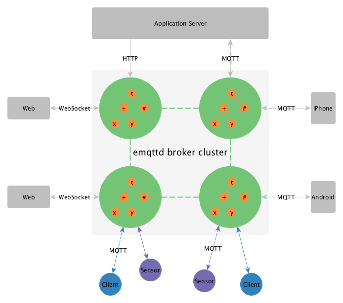

Overview
========

emqttd is a massively scalable and clusterable MQTT V3.1/V3.1.1 broker written in Erlang/OTP. emqttd support both MQTT V3.1/V3.1.1 protocol specification with extended features.

emqttd could connect Sensor, Mobile, Web Browser and Application Server with asynchronous PUB/SUB messsages.

Philosophy
----------

Focuse on scalable connection layer and message router layer.

Goals
-----

TODO:...

emqttd is aimed to provide a solid, enterprise grade, extensible open-source MQTT broker for IoT(M2M) applications that need to support ten millions of concurrent MQTT clients.

* Easy to install
* Massively scalable
* Easy to extend
* Solid stable

