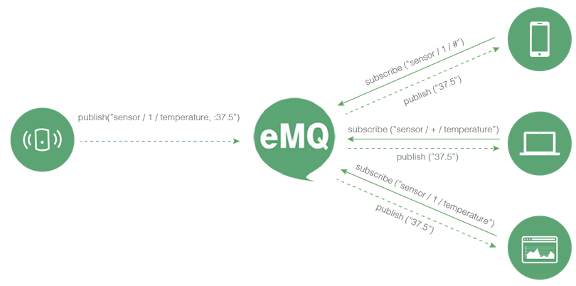

.. _mqtt:

TODO:...

=============
MQTT Protocol
=============

----------------------
MQTT Protocol Tutorial
----------------------

MQTT.ORG docs: a publish/subscribe messaging protocol which is extremely lightweight, for IoT, M2M and mobile messaging

Publish/Subscribe Model
-----------------------

MQTT Control Packets
--------------------

MQTT Packet Structure
---------------------

Compact: 1 byte header

MQTT Packet Types
-----------------

MQTT Packet Flags
-----------------

MQTT Client Libraries
---------------------

MQTT Client Libraries
---------------------

mosquitto_pub mosquitto_sub co

mqtt.org:

TODO: LIST

Maintained by emqtt.com:

TODO: LIST

-------------------------
QoS0, QoS1, QoS2 Messages
-------------------------

C->S Sequence...

----------------
Retained Message
----------------

publish a retained message::

    mosquitto_pub -t topic -m msg -q 1 -r

subscribe to get the message::

    mosquitto_sub -t topic -m msg -q 1 -r

------------
Will Message
------------

------------
Keep Alive
------------

----------------------------------
Clean Session and Offline Messages
----------------------------------

MQTT Client Libraries
---------------------

mosquitto_pub mosquitto_sub co

mqtt.org:

TODO: LIST

Maintained by emqtt.com:

TODO: LIST
